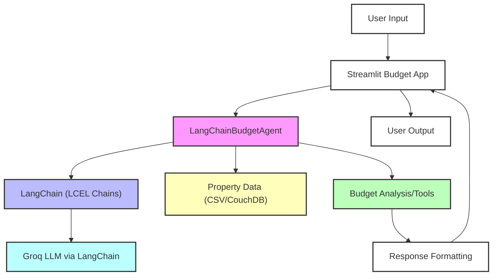

# Project Summary: Architect Assistant

## Main Agents and Their Purpose

- **LangChainBudgetAgent**: The primary and only budget agent. Handles all budget analysis, property search, and recommendations using LangChain and Groq LLM. Integrates with property data (CSV or CouchDB) and exposes tools for conversational and analytical tasks.

## Key Files and Their Purpose

- `agents/budget/langchain_budget_agent.py`: Main implementation of the budget agent using LangChain Expression Language (LCEL) and Groq LLM.
- `agents/budget/budget_analysis.py`: Contains logic for analyzing client budgets and market statistics.
- `agents/budget/client_interface.py`: Handles client input parsing and structured output.
- `agents/budget/couchdb_provider.py`: Provides CouchDB integration for property data (uses `requests`).
- `streamlit/streamlit_budget_app_fixed.py`: Main Streamlit app for interacting with the budget agent.
- `cleaned_data/`: Folder containing property CSVs for analysis.

## Required Dependencies (after cleanup)

- `langchain`
- `langchain-groq`
- `pandas`
- `numpy`
- `python-dotenv`
- `streamlit`
- `plotly`
- `requests` (for CouchDB provider)

## How to Run Each Key Script

### 1. **Streamlit Budget App**
```sh
streamlit run streamlit/streamlit_budget_app_fixed.py
```

### 2. **(Optional) Use the Agent in Python**
```python
from agents.budget.langchain_budget_agent import create_langchain_budget_agent
agent = create_langchain_budget_agent(groq_api_key="YOUR_KEY")
response = agent.chat("J'ai un budget de 200000 DT pour acheter une maison à Sousse")
print(response)
```

## Budget Agent Quick Start Guide

1. **Set up your environment:**
   - Add your Groq API key to a `.env` file as `GROQ_API_KEY=your_key_here`.
   - Ensure you have property data in `cleaned_data/` or a running CouchDB instance.
2. **Install dependencies:**
   ```sh
   pip install -r requirements.txt
   ```
3. **Run the Streamlit app:**
   ```sh
   streamlit run streamlit/streamlit_budget_app_fixed.py
   ```
4. **Interact with the agent:**
   - Enter your budget and preferences in the app.
   - The agent will analyze your input, search properties, and provide recommendations.

## System Flow Diagram



---

**Goal Achieved:** Minimal, clean, readable, and working codebase focused on a single, maintainable budget agent using LangChain and Groq LLM. 